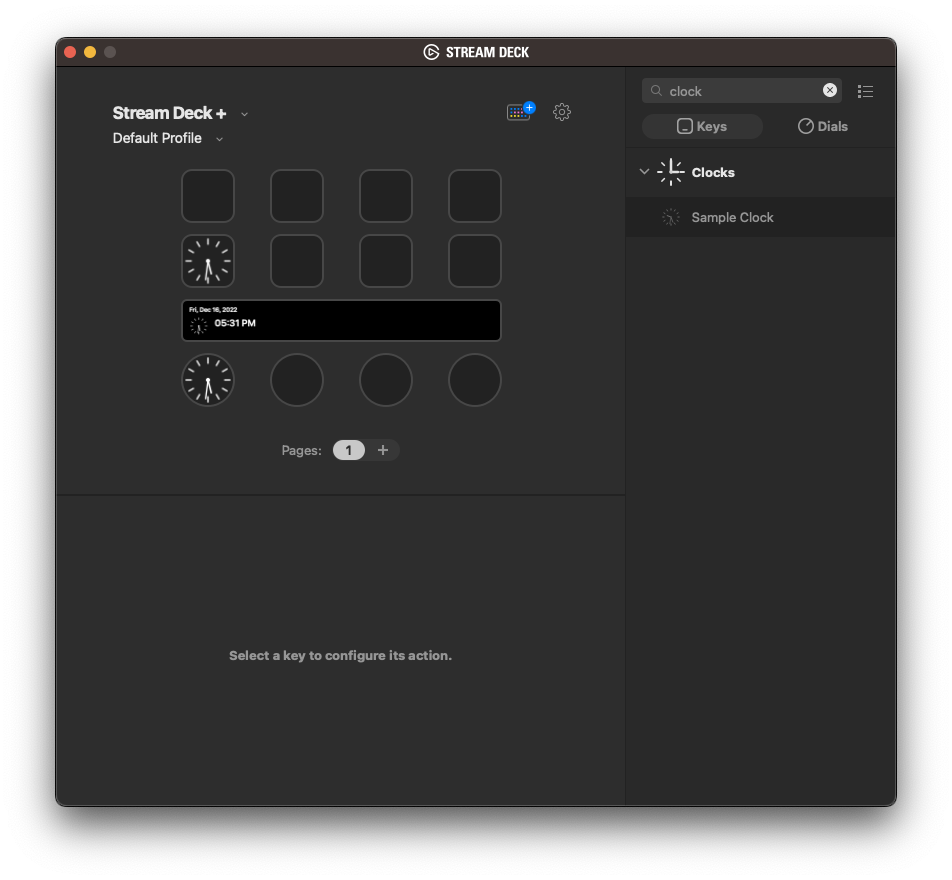

> [!IMPORTANT]  
> The new [Stream Deck SDK](https://github.com/elgatosf/streamdeck) is now available, with new [Stream Deck plugin samples](https://github.com/elgatosf/streamdeck-plugin-samples).
>
> You can also find the latest [Clocks plugin on Marketplace](https://marketplace.elgato.com/product/clocks-a150a62e-0e32-4d9c-9443-60b8b398e83a).
>
> This repository has been marked as deprecated, and will soon be deleted. If you have any questions, please contact us via [maker@elgato.com](maker@elgato.com), or join our [Makertplace Makers](https://discord.gg/GehBUcu627) Discord community.

# Sample Clock Plugin

This tiny plugin demonstrates how to include the javascript library into a plugin and how to use the library (in less than 100 lines of code - including a dynamic SVG icon and all code necessary to make use of `setImage`, `setFeedback`, `dialRotate`, `dialPress` and `touchTap`

## What it does

* it shows a tiny digital clock on either a key or SD+ touchpanel
* it uses our built-in `$A1` layout for this
* it shows the weekday in the title (you can switch that off in the PI)
* you can show/hide seconds by tapping the panel
* you can show/hide seconds by pressing the dial
